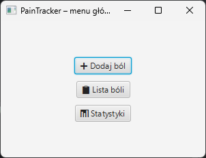
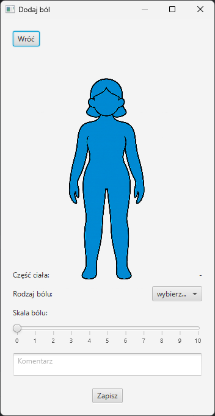
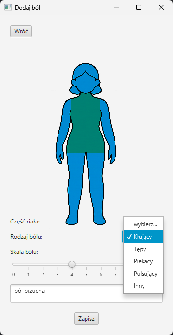
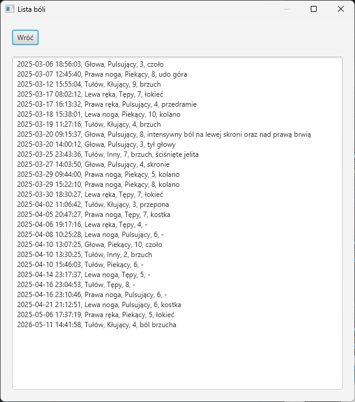

# Pain Tracker 🩺

Aplikacja desktopowa do monitorowania i lokalizowania bólu, stworzona w JavaFX. 

### 🛠 Kluczowe rozwiązania techniczne
- **Autorski system detekcji obszarów (Bitmasking):**
Zastosowanie autorskiego algorytmu masek kolorów do precyzyjnego rozpoznawania kliknięć na nieregularnych kształtach mapy ciała.
- **Trwałość danych (Persistence):**
System zapisu i odczytu historii zdarzeń w formacie CSV, zapewniający trwałość danych bez zewnętrznych zależności.
- **Modularny interfejs JavaFX:**
Architektura aplikacji oparta na wielu oknach (Stage), co pozwala na logiczne odseparowanie procesu wprowadzania danych od przeglądania historii (zgodnie z zasadą Single Responsibility).
- **Stabilność i Kompatybilność (JavaFX 21 LTS):**
Wykorzystanie stabilnej wersji bibliotek JavaFX 21 LTS w celu wyeliminowania błędów kompatybilności występujących w nowszych wersjach oraz zapewnienia wsparcia dla dołączonych bibliotek natywnych.
- **Portable Architecture:**
Aplikacja samowystarczalna – zawiera wszystkie niezbędne biblioteki (JAR i DLL), co gwarantuje poprawne uruchomienie na dowolnym systemie Windows.

### ✨ Funkcjonalności
- **Interaktywna mapa ciała:** Wybieranie konkretnych obszarów (głowa, tułów, kończyny) dzięki technologii masek bitowych.
- **Dziennik bólu:** Zapisywanie daty, lokalizacji, typu bólu oraz intensywności.
- **Baza danych:** Trwały zapis danych w formacie tekstowym (CSV-like).
- **Przenośność:** Dołączone biblioteki natywne pozwalają na uruchomienie aplikacji bez instalacji JavaFX w systemie.

### 🚀 Jak uruchomić?
1. Sklonuj repozytorium.
2. Zalecane środowisko: Java 21 lub nowsza (projekt korzysta z bibliotek JavaFX 21 LTS dla maksymalnej stabilności).
3. W IntelliJ dodaj pliki `.jar` z folderu `/lib` do bibliotek projektu.
4. Dodaj następujące **VM Options** w konfiguracji uruchamiania:
   `--module-path lib --add-modules javafx.controls,javafx.fxml,javafx.graphics -Dprism.order=sw`
5. Uruchom klasę **`Launcher`**.

*Uwaga: Aplikacja została zoptymalizowana pod kątem stabilności (JavaFX 21 LTS).*

### 📝 Symulacja korzystania (krok po kroku)

Jeśli nie możesz uruchomić aplikacji lokalnie, oto jak wygląda standardowa interakcja użytkownika:

**1. Menu Główne**

Po uruchomieniu wita Cię minimalistyczne menu z trzema opcjami: *Dodaj ból*, *Lista bóli* oraz *Statystyki* (WIP).

---

**2. Lokalizacja na mapie ciała**

Po kliknięciu "Dodaj ból" otwiera się okno z interaktywną mapą sylwetki.

- Użytkownik klika myszką bezpośrednio na część ciała, która go boli (rozróżniane są głowa, tułów, ręce prawa i lewa, nogi prawa i lewa).
- Program, dzięki zastosowaniu **masek bitowych**, natychmiast rozpoznaje kliknięty obszar (np. "Prawa noga" lub "Głowa") i wyświetla tę informację.

---

**3. Szczegóły wpisu**

Po wybraniu miejsca pojawia się formularz, w którym użytkownik doprecyzowuje dane:

- Określa **typ bólu** (np. pulsujący, kłujący, tępy).
- Wybiera **intensywność** w skali 0-10.
- Może dodać **krótki opis** (np. "ból po treningu" lub doprecyzowana część ciała).

---

**4. Zapis i Podgląd**

Po kliknięciu "Zapisz", dane lądują w pliku tekstowym. Użytkownik może wtedy przejść do sekcji "Lista bóli", gdzie w przejrzystym oknie TextArea widzi całą historię swoich wpisów wraz z datami i godzinami.

---

**5. Rozwój aplikacji**

Przycisk **Statystyki** na razie nie ma wykorzystania, jest to jedna z możliwych ścieżek dalszego rozwoju aplikacji.

---

*Projekt stworzony na potrzeby zaliczenia przedmiotu na studiach w roku akademickim 2024/2025.*

*Indywidualna praca Joanny Czeluśniak*
